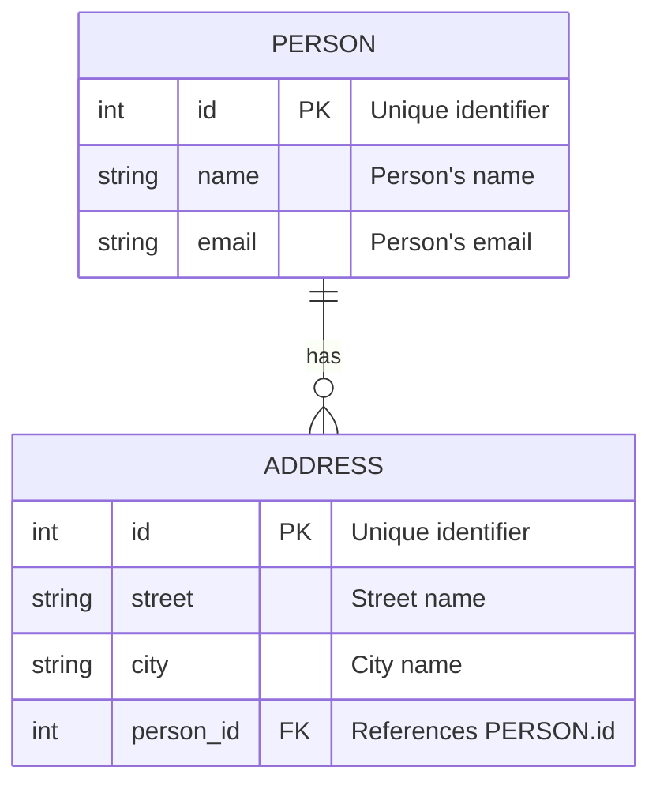

# GitHub Copilot lab for SQL

A hands-on lab to introduce people to working with GitHub Copilot and Structured Query Language (SQL). You do not need to be an experienced SQL developer to complete this lab!

**Proposed duration**: 40-60 minutes (excluding prerequisites setup).

## Prerequisites

- [Visual Studio Code](https://code.visualstudio.com/)**
- [GitHub Copilot](https://copilot.github.com/) installed and licensed
- [Markdown Preview Mermaid Support](https://marketplace.visualstudio.com/items?itemName=bierner.markdown-mermaid) extension for Visual Studio Code
- [SQLTools](https://marketplace.visualstudio.com/items?itemName=mtxr.sqltools)
- [SQLTools PostgreSQL driver](https://marketplace.visualstudio.com/items?itemName=mtxr.sqltools-driver-pg) (or driver for your selected database server)
- PostgreSQL database server (or another database server of your choice) with an empty database (or permissions to create a new database).

** You can also consider using [Azure Data Studio](https://learn.microsoft.com/azure-data-studio/download-azure-data-studio) which also supports GitHub Copilot and PostgresSQL via extensions.

### Database server

While SQL is a [standardised language](https://en.wikipedia.org/wiki/SQL#Interoperability_and_standardization) that can be used with many different database servers, this lab will use [PostgreSQL](https://www.postgresql.org/) as the database server.

You can use another database server if you prefer, but you may need to adjust some of the generated SQL commands to work with your selection.

If you cannot run a local PostgreSQL instance, consider using a cloud-based service like [Azure Database for PostgreSQL](https://learn.microsoft.com/azure/postgresql/flexible-server/how-to-deploy-on-azure-free-account) which offers a free tier (for 12 months) which will suffice for this lab.

You can complete the labs without access to a server, but you will not be able to run the SQL commands to see the results and validate that the code works as expected.

> [!IMPORTANT]
> GitHub Copilot Individual and Business works by referencing files held locally on your computer or in a Codespace. At time of writing GitHub Copilot does not support connecting to a database server to obtain additional context such as your database engine vendor and version or any deployed artefacts (schemas, tables, etc). Keep this in mind when working with SQL and GitHub Copilot.

---

### Pre-lab challenge

All database servers have a default database. For Postgres it's called `postgres`, for MySQL it's called `mysql`, and for SQL Server it's called `master`. Oracle has a default database called `system`.

It's not recommended to use the default database for your application data, so the for our first "pre-challenge" is to create a new database on your database server.

First you will need to connect to your database server and select the default database.

Next, open a new SQL file in your editor and use Copilot to generate the SQL command to create a new database and then also grant your user full privileges on the new database.

Once the database is created you may need to update your connection settings to use the new database and reconnect.

Stuck? Check out the [pre-challenge lab help](help/pre-challenge.md) for a hint.

---

## Lab 1: Create related tables

In the sample-data folder you will find three CSV files:

- [address.csv](sample-data/address.csv) - This file contains a list of addresses with the street, city, state, and postal code.
- [customer.csv](sample-data/customer.csv) - This file contains a list of customers with their name, email address, and the date they became a customer.
- [order.csv](sample-data/order.csv) - This file contains a list of orders with the order number, the customer who placed the order, the date the order was placed, and the total amount of the order.

Using these three files and GitHub Copilot, create the tables required to store this data in your database.

Make sure to create foreign key constraints where appropriate.

> [!TIP]
> Try using Copilot Chat and file referencing.

Once you have created the SQL make sure to save the file. Call it `lab1.sql`.

Ensure that you have documentation in the SQL file that explains the purpose of each table and the relationships between the tables.

While you can bulk insert the data from the CSV files, you don't need to do this for this lab. Use GitHub Copilot to create `INSERT` statements to insert the data from each CSV.

> [!TIP]
> Did you run into `-- More rows...` or a similar response from Copilot and didn't get the SQL for all the rows? You are likely experiencing the token limit for the large language model that sits behind Copilot. Try clearing your Chat history using `/clear` and trying again.

Stuck? Check out the [lab 1 help](help/lab1.md) for hints.

## Lab 2: Building Database Logic

Now we have a database defined, let's create some logic to interact with the data.

You may be familiar with database views, stored procedures, and triggers. These are all ways to interact with the data in the database.

### Create a view

Create a view that shows that shows customer orders and which doesn't include the customer's ID.

Once you've created the view, ask Copilot to update the definition so it includes the Customer ID field and that orders are grouped by customer.

> [!TIP]
> If you run into issues, make sure to use GitHub Copilot chat to help identify how to fix them. You should be able to create and update the view without needing to write the SQL from scratch.

### Create a stored procedure or function

Before you implement a solution for this brief, ask GitHub Copilot Chat what the differences are between a stored procedure and a function.

Once you understand the differences, create a solution for these scenarios:

- Provide a way to get the total number of orders for a customer.
- Provide a way to get the total value of orders for a customer.

Once you've created the stored procedure or function, see if you can optimise the resulting SQL. What changes does Copilot suggest? Are they valid?

Stuck? Check out the [lab 2 help](help/lab2.md) for hints.

## Lab 3: Debugging SQL

In this lab, you will be given a a series of SQL-related problems and your task is to use GitHub Copilot to identify the issues and fix them.

### Fixing a query

The SQL file is called [lab3-query.sql](sample-data/lab3-query.sql) and is located in the `sample-data` folder. The query is designed to run against a database that has had the tables created in Lab 1. The query is shown below.

```sql
SELECT C.Firstname, A.AddressLine1, A.AddressLine2, A.City, A.State, A.ZipCode
FROM Customer AS C
JOIN Address AS A ON CustomerID = A.CustomerID
WHERE A.IsShippingAddress = TRUE AND A.IsBillingAddress = FALSE;
ORDER BY C.Firstname
GROUP BY A.City 
```

First up, try opening the SQL file and executing the query. If it doesn't run as expected, use GitHub Copilot to help identify the issue and fix it. There may be more than one problem with the query. Make sure that any solution you provide includes both an `ORDER BY` and a `GROUP BY` clause.

> [!TIP]
> Depending on the database server you are using you might need to copy/paste any errors you receive into the chat to get help from Copilot. If you are using the command-line you could try out the `@terminal` agent.

### Modifying the Customer table

In order to complete this next lab step, you will need to modify the `Customer` table to include a `EmailAddress` field. Use GitHub Copilot to generate the SQL to add this field to the table and to set the default to `NULL`. This field should hold case insensitive text. If your database server does not support case insensitive text, use a `VARCHAR(254)` field instead.

Make sure to update the `lab1-solution.sql` file with the updated `Customer` table definition so you can use it in future exercises. Save the updated file as `lab3-solution.sql`.

### Fixing a stored procedure

The below stored procedure runs fine but has some issues that have caused odd behaviour in the application using it. You can find a copy of this stored procedure in the [lab3-sproc.sql](sample-data/lab3-sproc.sql) file located in the `sample-data` folder. The issues highlighted are:

- Any data can be inserted into the `EmailAddress` field without validation.
- If a non-existent customer ID is passed, the provided data is lost and no error is returned.

```sql
CREATE OR REPLACE FUNCTION update_existing_customer_email(customer_id UUID, new_email CITEXT)
RETURNS VOID AS $$
BEGIN
    -- Update the customer's email address
    UPDATE Customer
    SET EmailAddress = new_email
    WHERE CustomerID = customer_id;
END;
$$ LANGUAGE plpgsql;
```

You can test out this stored procedure by running the below SQL:

```sql
-- No error is returned
SELECT update_customer_email('7f1cf3dd-2281-41ec-8847-bab8411dbc6d', 'myemailaddress');
-- The data provided does not appear in the table
SELECT * from Customer;
```

Using GitHub Copilot, address the two highlighted issues and then validate the stored procedure works as expected by attempting to:

- Update the email address for a customer that doesn't exist (provide a GUID not listed in the table).
- Update the email address for a customer with an invalid email address (e.g. `myemailaddress`).

Here's an extra challenge - once you've fixed the stored procedure, see if you can optimise the SQL generated by Copilot. What changes does Copilot suggest? Are they valid?

Stuck? Check out the [lab 3 help](help/lab3.md) for hints.

## Lab 4: Understanding SQL

### Generating an Entity Relationship (ER) diagram

In this lab, you will use GitHub Copilot to generate an ER diagram for the tables you created in Lab 1. The ER diagram should be created as a [Mermaid diagram](https://mermaid.js.org/syntax/entityRelationshipDiagram.html) that can be embedded in a markdown file and should include the table names and field data types (but not the field properties such as size or constraints).

A sample is shown below (you will need the appropriate Mermaid extension for Visual Studio Code to view this locally).



### Describing complex SQL

You will find a series of SQL queries in the [lab4-query.sql](sample-data/lab4-query.sql) file located in the `sample-data` folder.

Use GitHub Copilot to explain what each query does and how it works. You can compare the description from GitHub Copilot against the results in the lab help file. Also ask GitHub Copilot how the resulting data from each query might be used so you can determine the intent of the query, not just how it functions.

Check out the [lab 4 help](help/lab4.md) for hints and solutions.

## That's a wrap

Thanks for completing the GitHub Copilot lab for SQL. We hope you enjoyed working with GitHub Copilot and SQL and that you learned something new. Please check out our list of labs and resources for more hands-on learning experiences on our [GitHub repository](https://github.com/Insight-Services-APAC/github-copilot-labs-list).

[Back to top 👆](#github-copilot-lab-for-sql)