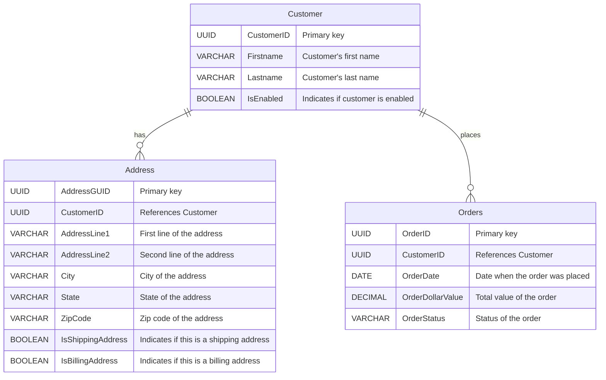

# Lab 4 help

## Generating an Entity Relationship (ER) diagram

GitHub Copilot can help you generate an ER diagram from a textual description of the database schema. Make sure to add the lab1-solution.sql file as a reference and to ask Copilot to generate only using field types.

If you find that the output includes field sizes (i.e. `VARCHAR(255)` instead of just `VARCHAR`), iterate on the previous response and ask Copilot to generate the ER diagram without field sizes.

A sample ER diagram is shown below,

## Describing complex SQL

Read description for:

- [Query 1](#query-1-description)
- [Query 2](#query-2-description)
- [Query 3](#query-3-description)

### Query 1 description

The SQL query you've provided is designed to select a single customer record at random from a database, under specific conditions. Here's a breakdown of its components and what they achieve:

1. **SELECT Statement:** The query starts with a SELECT statement that retrieves various pieces of information about customers, including their ID, first name, last name, and address details.

2. **FROM Clause with Subquery:** The data is fetched from a subquery that combines information from the Customer, Orders, and Address tables. This is done using JOIN operations.

3. **JOIN Conditions:**

  - The first JOIN connects the Customer table (c) with the Orders table (o) where the CustomerID matches and the customer is enabled (IsEnabled IS TRUE).
  - The second JOIN connects the Customer table with the Address table (a) where the CustomerID matches and the address is marked as a shipping address (IsShippingAddress IS TRUE).

4. **WHERE Clause:** This filters the orders to include only those that have been shipped (OrderStatus = 'Shipped') and have a dollar value greater than 500.

5. **Subquery Alias:** The subquery is given an alias RandomCustomer, making it easier to refer to in the outer query.

6. **ORDER BY RANDOM():** This orders the results of the subquery in a random manner. It's a way to shuffle the rows before applying the limit.

7. **LIMIT 1:** This limits the result to just one record. Because of the random ordering, this effectively selects one customer at random from those who meet the criteria.

In summary, this query is used to randomly select a single customer who has an enabled account, has a shipping address on file, and has placed an order worth more than $500 that has been shipped. This could be useful for promotional purposes, such as selecting a customer for a prize or special offer.

### Query 2 description

The SQL query you've highlighted uses the GROUP BY CUBE operation. This operation is a part of the SQL standard used for creating subtotals and grand totals within a result set. Let's break down what this specific query does and how its results might be utilized:

#### The Query

1. **SELECT Clause:** This part of the query selects three columns: addressguid, state, and a count of rows that match the grouping criteria. The count(*) function counts the number of rows in each group.

2. **FROM Clause:** The data is fetched from the address table, which presumably contains records of addresses, each identified by a unique addressguid and associated with a state.

3. **GROUP BY CUBE:** The CUBE operation generates a result set that includes aggregates for all combinations of the grouped columns. In this case, it's grouping by addressguid and state. This means the result set will include:

- A total count for each unique addressguid across all states.
- A total count for each state across all address GUIDs.
- A grand total count that includes all rows in the address table.
- Counts for each combination of addressguid and state.

#### How Its Data Might Be Used

The data produced by this query can be extremely useful for analytical and reporting purposes. Here are a few examples of how it might be used:

- **Geographical Analysis:** By examining the counts by state, analysts can identify which states have the most addresses listed, which could be useful for market analysis, logistics planning, or targeted marketing campaigns.

- **Data Integrity Checks:** The counts by addressguid can help in identifying data integrity issues. For example, if an addressguid is supposed to be unique but has a count greater than 1, this could indicate duplicate records.

- **Overall Metrics:** The grand total provides a simple count of all addresses in the database, which is a useful high-level metric for reports.

- **Detailed Breakdowns:** The counts for each combination of addressguid and state offer a detailed breakdown that could be useful for understanding the distribution of addresses at a more granular level.

In summary, the GROUP BY CUBE operation in this query provides a powerful tool for generating a comprehensive set of aggregate data from the address table, supporting a wide range of analytical and reporting needs.

### Query 3 description

This SQL query is designed to select customer numbers (custno) from a customer table (cust), but with a twist. It's looking for customer numbers that do not have a subsequent customer number. In other words, it finds the last customer number in a sequence and then adds 1 to it.

Let's break it down step by step:

1. **Main Query:** The main part of the query SELECT custno + 1 FROM cust a starts by selecting customer numbers from the cust table (aliased as a), but it adds 1 to each customer number. This operation suggests the intention to find the next potential customer number in sequence.

2. **WHERE Clause with NOT EXISTS:** The WHERE clause uses a NOT EXISTS subquery to filter the results. The NOT EXISTS condition is used to exclude rows from the main query based on the condition specified within its subquery.

3. **Subquery:** Inside the NOT EXISTS, there's another SELECT statement that selects NULL. This might seem odd at first, but the actual output of this subquery is not important. What matters is whether the subquery returns any rows at all. The subquery is checking the same cust table (aliased as b) to see if there exists a customer number that is exactly 1 more than the customer number from the outer query (a.custno = b.custno + 1).

4. **Logic Behind the Subquery:** The condition a.custno = b.custno + 1 is checking for the existence of a "next" customer number for each customer number in the table. If such a customer number exists, the subquery returns rows, and the NOT EXISTS condition fails, excluding the current custno from the main query's results.

5. **Result:** The query ultimately returns customer numbers that do not have a direct subsequent customer number in the sequence. By adding 1 to these numbers, it suggests potential new customer numbers following the last number in existing sequences.

6. **ORDER BY Clause:** Finally, the ORDER BY custno clause ensures that the results are sorted in ascending order based on the original customer numbers. This makes the output easier to understand and follow, especially if there are multiple non-sequential gaps in the customer numbers.

In summary, this query is useful for identifying gaps in a sequence of customer numbers and suggesting the next possible customer number by adding 1 to the last number in any existing sequence.

---

[Home](../README.md#lab-4-understanding-sql)
